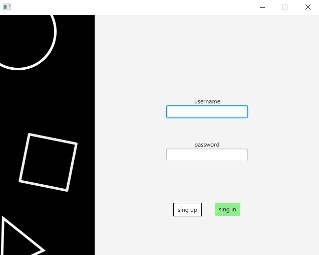
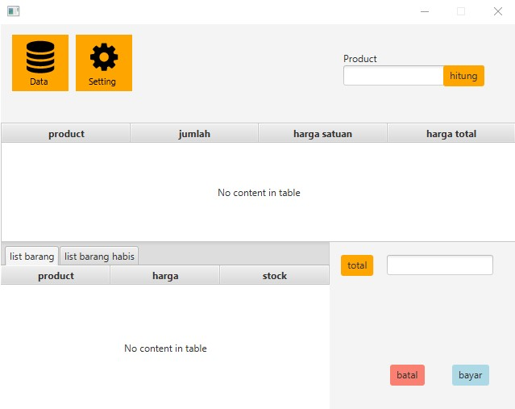
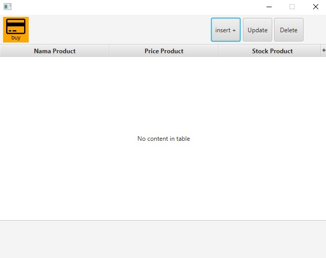

# Kasir GUI

membuat kasir sederhana berbasis GUI dengan teknologi JavaFx. ini dibuat sebagai project mandiri muammar zaki

**31-12-2022*

## Fiture

- [x] data save mengunakan file json
- [x] insert, update, delete kepada file JSON
- [ ] Audit transaksi

## Download

untuk mendapatkan lates versi [download](https://github.com/Muammarzaki/kasir-gui/releases) kasir marsal

    semoga bermanfaat

## Beberapa gambar untuk melengkapi doc  

